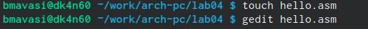
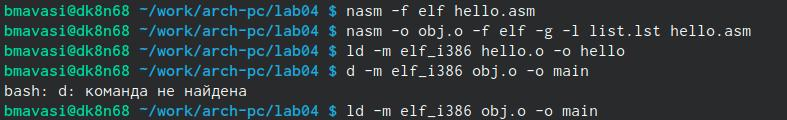
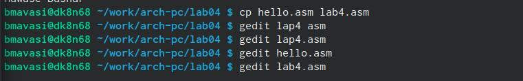
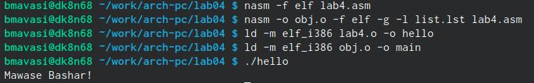
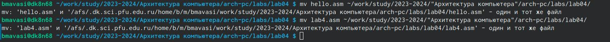
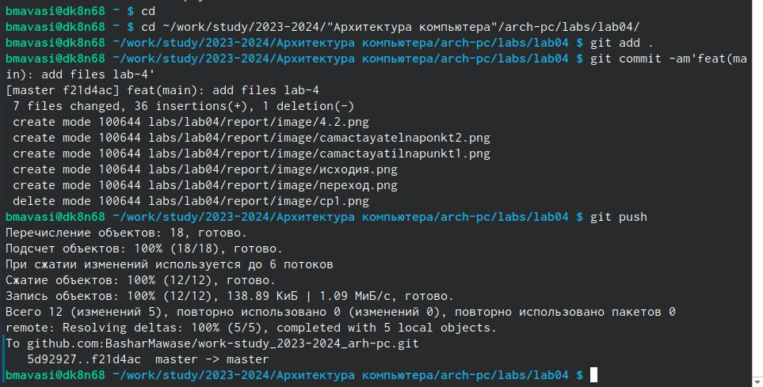

---
## Front matter
title: "Отчет по лабораторной работа №4"
subtitle: "Дисциплина: архитектура компьютера"
author: "Маваси Башар"

## Generic otions
lang: ru-RU
toc-title: "Содержание"

## Bibliography
bibliography: bib/cite.bib
csl: pandoc/csl/gost-r-7-0-5-2008-numeric.csl

## Pdf output format
toc: true # Table of contents
toc-depth: 2
lof: true # List of figures
lot: true # List of tables
fontsize: 12pt
linestretch: 1.5
papersize: a4
documentclass: scrreprt
## I18n polyglossia
polyglossia-lang:
  name: russian
  options:
	- spelling=modern
	- babelshorthands=true
polyglossia-otherlangs:
  name: english
## I18n babel
babel-lang: russian
babel-otherlangs: english
## Fonts
mainfont: PT Serif
romanfont: PT Serif
sansfont: PT Sans
monofont: PT Mono
mainfontoptions: Ligatures=TeX
romanfontoptions: Ligatures=TeX
sansfontoptions: Ligatures=TeX,Scale=MatchLowercase
monofontoptions: Scale=MatchLowercase,Scale=0.9
## Biblatex
biblatex: true
biblio-style: "gost-numeric"
biblatexoptions:
  - parentracker=true
  - backend=biber
  - hyperref=auto
  - language=auto
  - autolang=other*
  - citestyle=gost-numeric
## Pandoc-crossref LaTeX customization
figureTitle: "Рис."
tableTitle: "Таблица"
listingTitle: "Листинг"
lofTitle: "Список иллюстраций"
lotTitle: "Список таблиц"
lolTitle: "Листинги"
## Misc options
indent: true
header-includes:
  - \usepackage{indentfirst}
  - \usepackage{float} # keep figures where there are in the text
  - \floatplacement{figure}{H} # keep figures where there are in the text
---

# Цель работы

Освоение процедуры компиляции и сборки программ, написанных на ассемблере NASM.

# Задание

Здесь приводится описание задания в соответствии с рекомендациями
методического пособия и выданным вариантом.

# Выполнение лабораторной работы

Создаём каталог для работы с программами на языке ассемблера NASM, переходим в созданный каталог. (рис. @fig:001).

{#fig:001 width=70%}

Создаём текстовый файл с именем hello.asm с помощью команды touch, далее открываем его с помощью текстового редактора gedit (рис. @fig:002)

{#fig:002 width=70%}

Для компиляции текста программы «Hello World» написал:nasm -f elf hello.asm,скомпилировал исходный файл hello.asm в obj.o с помощью команды nasm -o obj.o -f elf -g -l list.lst hello.asm,передал объектный файл на обработку компоновщику с помощью команды:ld -m elf_i386 hello.o -o hello, ld -m elf_i386 obj.o -o main- задал имя создаваемого исполняемого файла.
(рис. @fig:003)

{#fig:003 width=70%}

# Выполнение самостоятельной работы

В каталоге ~/work/arch-pc/lab04 с помощью команды cp создал копию файла hello.asm с именем lab4.asm,открыл редактор чтобы внести изменения.
(рис. @fig:004)

{#fig:004 width=70%}

Оттранслировал полученный текст программы lab4.asm в объектный файл. Выполнил
компоновку объектного файла и запустил получившийся исполняемый файл.
(рис. @fig:005)

{#fig:005 width=70%}

Скопировал файлы hello.asm и lab4.asm в свой локальный репозиторий в каталог ~/work/study/2023-2024/"Архитектура компьютера"/arch-pc/labs/lab04/
(рис. @fig:006)

{#fig:006 width=70%}

Загрузил файлы на github (рис. @fig:007)

{#fig:007 width=70%}
 Листинги:
 hello.asm
 SECTION .data
	hello:      db "Hello, world!",0xa 
		helloLen:   equ $ - hello
SECTION .text
	global _start           

_start:                 
        mov eax, 4      
        mov ebx, 1    
        mov ecx, hello
        mov edx, helloLen
        int 0x80        
	
	mov eax, 1       
        mov ebx, 0      
        int 0x80  

lab4.asm

SECTION .data
	hello:      db "Маваси Башар",0xa 
		helloLen:   equ $ - hello
SECTION .text
	global _start           

_start:                 
        mov eax, 4      
        mov ebx, 1    
        mov ecx, hello
        mov edx, helloLen
        int 0x80        
	
	mov eax, 1       
        mov ebx, 0      
        int 0x80  
# Выводы

После выполнения лабораторной работы были освоены процедуры компиляции и сборки программ, написанных на ассемблере NASM.
