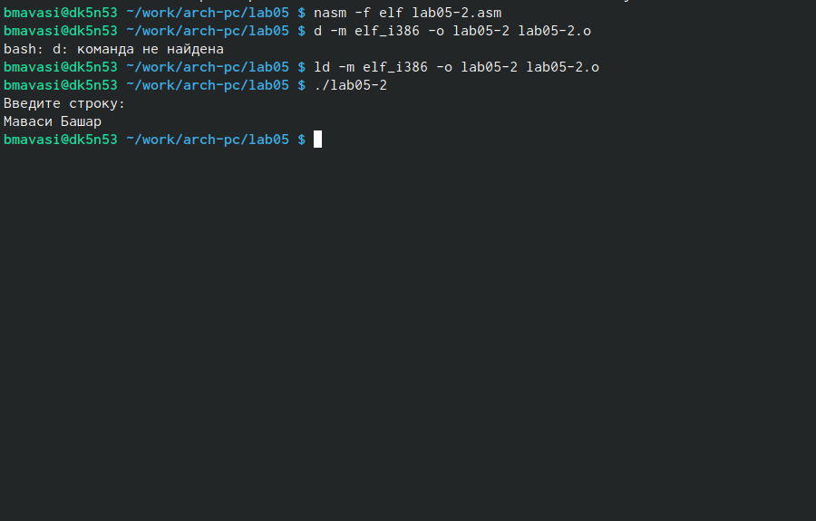

---
## Front matter
title: "Отчет по лабараторной работе №5"
subtitle: "Архитерктура компьютера"
author: "Маваси Башар"

## Generic otions
lang: ru-RU
toc-title: "Содержание"

## Bibliography
bibliography: bib/cite.bib
csl: pandoc/csl/gost-r-7-0-5-2008-numeric.csl

## Pdf output format
toc: true # Table of contents
toc-depth: 2
lof: true # List of figures
lot: true # List of tables
fontsize: 12pt
linestretch: 1.5
papersize: a4
documentclass: scrreprt
## I18n polyglossia
polyglossia-lang:
  name: russian
  options:
	- spelling=modern
	- babelshorthands=true
polyglossia-otherlangs:
  name: english
## I18n babel
babel-lang: russian
babel-otherlangs: english
## Fonts
mainfont: PT Serif
romanfont: PT Serif
sansfont: PT Sans
monofont: PT Mono
mainfontoptions: Ligatures=TeX
romanfontoptions: Ligatures=TeX
sansfontoptions: Ligatures=TeX,Scale=MatchLowercase
monofontoptions: Scale=MatchLowercase,Scale=0.9
## Biblatex
biblatex: true
biblio-style: "gost-numeric"
biblatexoptions:
  - parentracker=true
  - backend=biber
  - hyperref=auto
  - language=auto
  - autolang=other*
  - citestyle=gost-numeric
## Pandoc-crossref LaTeX customization
figureTitle: "Рис."
tableTitle: "Таблица"
listingTitle: "Листинг"
lofTitle: "Список иллюстраций"
lotTitle: "Список таблиц"
lolTitle: "Листинги"
## Misc options
indent: true
header-includes:
  - \usepackage{indentfirst}
  - \usepackage{float} # keep figures where there are in the text
  - \floatplacement{figure}{H} # keep figures where there are in the text
---

# Цель работы

Приобретение практических навыков работы в Midnight Commander. Освоение инструкций языка ассемблера mov и int.

# Выполнение лабораторной работы

С помощью команды mc открыл Midnight Commander, нашел файл lab5-1.asm, зашел в него и ввел нужный текст  (рис. @fig:001).

{#fig:001 width=70%}

 Оттранслируйте текст программы lab5-1.asm в объектный файл. Выполните компо-
новку объектного файла и запустите получившийся исполняемый файл и ввел свои имя и фамилию. (рис. @fig:002).

{#fig:002 width=70%}

Создал копию файла lab5-1.asm с именем lab5-2.asm и редактировал в нем текст (рис. @fig:003).

{#fig:003 width=70%}

Оттранслируйте текст программы lab5-2.asm в объектный файл. Выполните компо-
новку объектного файла и запустите получившийся исполняемый файл и ввел свои имя и фамилию. (рис. @fig:004).

{#fig:004 width=70%}

# Выполнение самостоятельной работй

Копирую файл lab5-1.asm с именем lab5-1.1.asm   (рис. @fig:005).

{#fig:005 width=70%}

Изменяю код программы, добавляя вывод введенной строки  (рис. @fig:006).

{#fig:006 width=70%}

Создаю объектный файл lab5-1.1.o, компоную его в исполняемый файл, запускаю
исполняемый файл (рис. @fig:007).

{#fig:007 width=70%}

Программа из пункта 1:
;------------------- Объявление переменных ----------------
SECTION .data ; Секция инициированных данных
msg: DB 'Введите строку:',10 ; сообщение плюс
; символ перевода строки
msgLen: EQU $-msg ; Длина переменной 'msg'
SECTION .bss ; Секция не инициированных данных
buf1: RESB 80 ; Буфер размером 80 байт
;------------------- Текст программы -----------------
SECTION .text ; Код программы
GLOBAL _start ; Начало программы
_start: ; Точка входа в программу
mov eax,4 ; Системный вызов для записи (sys_write)
mov ebx,1 ; Описатель файла 1 - стандартный вывод
mov ecx,msg ; Адрес строки 'msg' в 'ecx'
mov edx,msgLen ; Размер строки 'msg' в 'edx'
int 80h ; Вызов ядра
mov eax, 3 ; Системный вызов для чтения (sys_read)
mov ebx, 0 ; Дескриптор файла 0 - стандартный ввод
mov ecx, buf1 ; Адрес буфера под вводимую строку
mov edx, 80 ; Длина вводимой строки
int 80h ; Вызов ядра
mov eax,4 ; Системный вызов для записи (sys_write)
mov ebx,1 ; Описатель файла '1' - стандартный вывод
mov ecx,buf1 ; Адрес строки buf1 в ecx
mov edx,buf1 ; Размер строки buf1
int 80h ; Вызов ядра
mov eax,1 ; Системный вызов для выхода (sys_exit)
mov ebx,0 ; Выход с кодом возврата 0 (без ошибок)
int 80h ; Вызов ядра

Копирую файл lab5-2.asm с именем lab5-2.2.asm   (рис. @fig:008).

{#fig:008 width=70%}

Изменяю код программы, добавляя вывод введенной строки  (рис. @fig:009).

{#fig:009 width=70%}

Создаю объектный файл lab5-2.2.o, компоную его в исполняемый файл, запускаю
исполняемый файл (рис. @fig:010).

{#fig:010 width=70%}

# Выводы

Я приобрел практических навыков работы в Midnight Commander. Освоение инструкций языка ассемблера mov и int.

