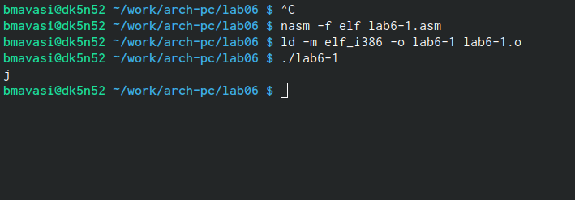
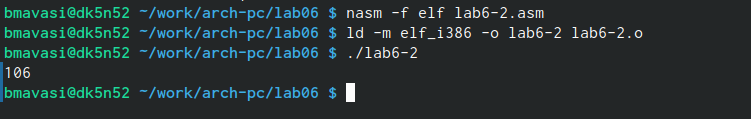
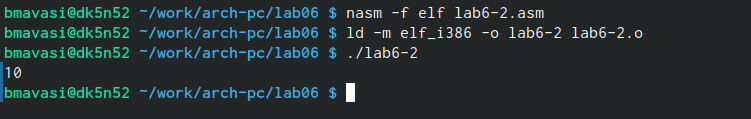
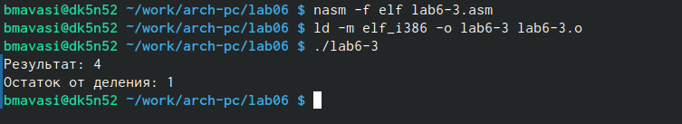
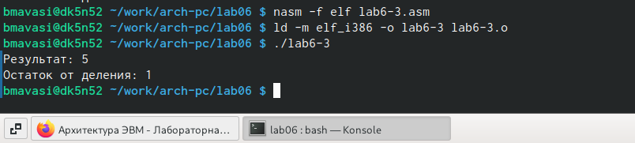
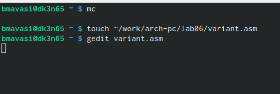
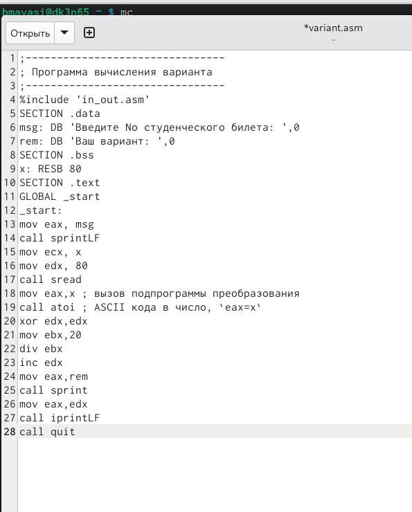
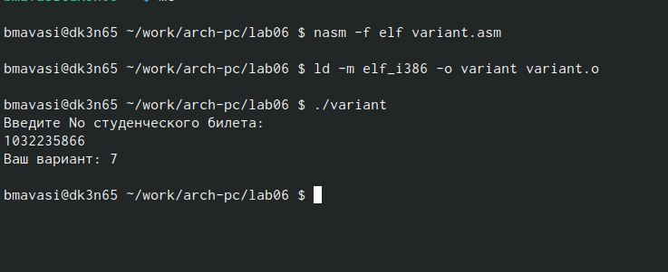
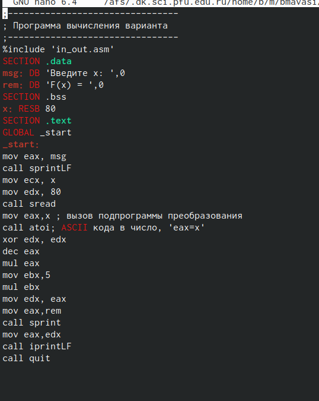
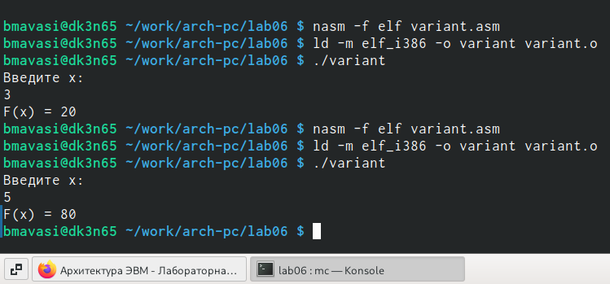

---
## Front matter
title: "Отчет по лабараторной работе №6"
subtitle: "Архитерктура компьютера"
author: "Маваси Башар"

## Generic otions
lang: ru-RU
toc-title: "Содержание"

## Bibliography
bibliography: bib/cite.bib
csl: pandoc/csl/gost-r-7-0-5-2008-numeric.csl

## Pdf output format
toc: true # Table of contents
toc-depth: 2
lof: true # List of figures
lot: true # List of tables
fontsize: 12pt
linestretch: 1.5
papersize: a4
documentclass: scrreprt
## I18n polyglossia
polyglossia-lang:
  name: russian
  options:
	- spelling=modern
	- babelshorthands=true
polyglossia-otherlangs:
  name: english
## I18n babel
babel-lang: russian
babel-otherlangs: english
## Fonts
mainfont: PT Serif
romanfont: PT Serif
sansfont: PT Sans
monofont: PT Mono
mainfontoptions: Ligatures=TeX
romanfontoptions: Ligatures=TeX
sansfontoptions: Ligatures=TeX,Scale=MatchLowercase
monofontoptions: Scale=MatchLowercase,Scale=0.9
## Biblatex
biblatex: true
biblio-style: "gost-numeric"
biblatexoptions:
  - parentracker=true
  - backend=biber
  - hyperref=auto
  - language=auto
  - autolang=other*
  - citestyle=gost-numeric
## Pandoc-crossref LaTeX customization
figureTitle: "Рис."
tableTitle: "Таблица"
listingTitle: "Листинг"
lofTitle: "Список иллюстраций"
lotTitle: "Список таблиц"
lolTitle: "Листинги"
## Misc options
indent: true
header-includes:
  - \usepackage{indentfirst}
  - \usepackage{float} # keep figures where there are in the text
  - \floatplacement{figure}{H} # keep figures where there are in the text
---

# Цель работы

Освоение арифметических инструкций языка ассемблера NASM.

# Задание

![создание первого файла] (image/2.jpg) {#fig:001 width=70%} 
создаю файл

![скопривать] (image/4.jpg) {#fig:002 width=70%} скопировал 

 {#fig:003 width=70%}

![создание второго файла] (image/2.jpg) {#fig:004 width=70%} 
создаю файл

![скопривать] (image/6.jpg) {#fig:005 width=70%} скопировал 

 {#fig:006 width=70%}

 {#fig:007 width=70%}

 {#fig:008 width=70%}

![скопривать] (image/10.jpg) {#fig:005 width=70%} скопировал 

 {#fig:008 width=70%}

Oтветы на вопросы

1. За вывод сообщения "Ваш вариант" отвечают строчки кода mov eax,rem call sprint

2. Инструкция mov ес, х используется, чтобы положить адрес вводимой строки х в регистр есх mov edx, 80 - запись в регистр edx длины вводимой строки call sread - вызов подпрограммы из внешнего файла, обеспечивающей ввод сообщения с клавиатуры.

3. call atoi используется для вызова подпрограммы из внешнего файла, которая преобразует ascii-код символа в целое число и записывает результат в регистр eax.

4. За вычисления варианта отвечают строки: хот edx,edx ; обнуление еах для корректной работы div mov ebx, 20 ; ebx = 20 div ebx; eax = eax/20, edx - остаток от деления inc edx; edx = edx + 1

5. При выполнении инструкции div ebx остаток от деления записывается в регистр edx.

6. Инструкция inc edx увеличивает значение регистра edx на 1.

7. За вывод на экран результатов вычислений отвечают строки: mov eax,edx call iprintLF

# Теоретическое введение

# Выполнение самостоятельной работой

 {#fig:001 width=70%}
 сосдаю файл для варианта

 {#fig:001 width=70%}
скопировал программу чтобы узнать свой вариант

 {#fig:003 width=70%} 
 узнал свой вариант

 {#fig:004 width=70%} 
писал праграмму своего варианта

 {#fig:005 width=70%}

# Выводы

Я освоил арифметические инструкции языка ассемблера NASM.

# Список литературы{.unnumbered}

::: {#refs}
:::
